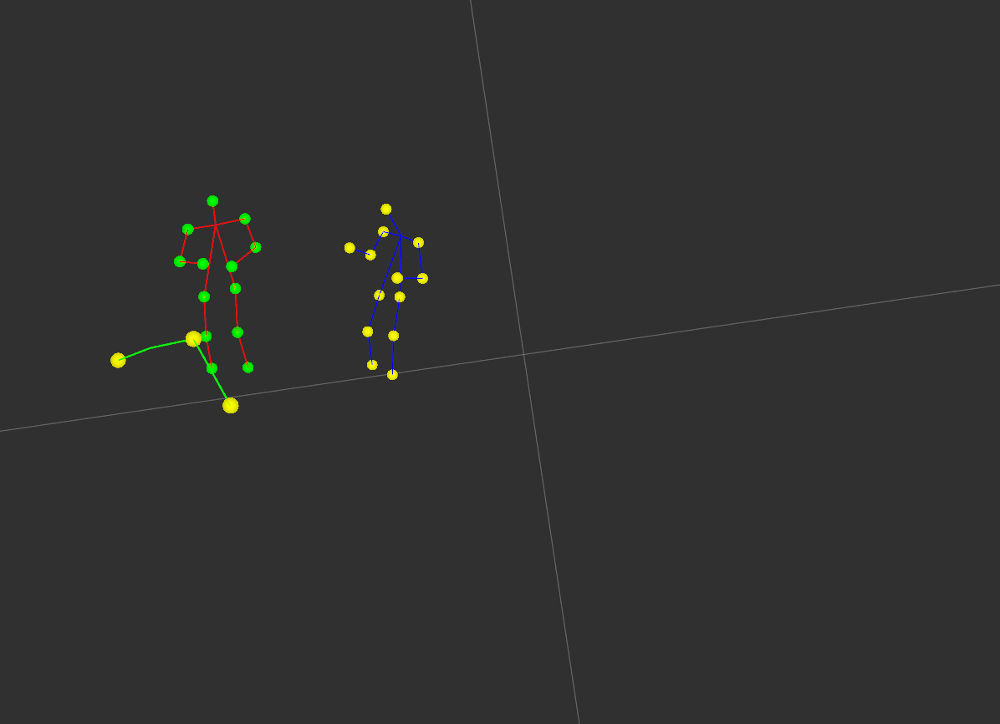

# Real-time 3D Multi-Person Pose Estimation: Using Lightweight OpenPose as 2D backbone

This repository contains the implementation of 3D Multi-Person pose estimation using the lightweight OpenPose as as 2D backbone. Corresponding joints from two frames are triangulated to get the 3D pose. The mean of the skeletons is tracked using a Kalman filter

<p align="center">
  
</p>

## Table of Contents

* [Requirements](#requirements)
* [Prerequisites](#prerequisites)
* [v02.12.2020](#v02.12.2020)
* [Python demo](#python-demo)
* [Citation](#citation)

## Requirements

* Ubuntu 16.04
* Python 3.6
* PyTorch 0.4.1 (should also work with 1.0, but not tested)

## Prerequisites

1. Install requirements `pip install -r requirements.txt`

## v02.12.2020
* branch develop/pythongpucmuinference
* The light weight OpenPose is used as a backbone for 2D pose estimation
* The Feature vector is extracted for each person detected(passing the bounding box as input to a Person Re-Identification deep learning model)
* We use Hungarian minimization algorithm on the cost matrix between the feature vectors of the detected person on both frames to get the corresponding persons
* This version of the code uses the kalman filter for tracking the skeleton IDs(The mean of the skeleton joints are tracked)
* The detected skeleton and the skeleton IDs are published on mqtt to the topics "/pose_cam/triangulate/pose_3d" and "/pose_cam/triangulate/skeletonIDTracker" respectively
* The published skeleon can be visualized on ROS
#### Known issue


## Python Demo <a name="python-demo"/>

This version uses video sequence from CMU and runs without thread. This version was used fro evaluating the 3D poses, reid and marker trackerWe provide python demo just for the quick results preview. Please, consider c++ demo for the best performance. To run the python demo from a webcamWe provide python demo just for the quick results preview. Please, consider c++ demo for the best performance. To run the python demo from a webcam:
* `python demo_without_thread_cmu_videos.py --checkpoint-path pretrained_model/checkpoint_iter_370000.pth`

## Citation:

If this helps your research, please cite the paper:

```
@inproceedings{osokin2018lightweight_openpose,
    author={Osokin, Daniil},
    title={Real-time 2D Multi-Person Pose Estimation on CPU: Lightweight OpenPose},
    booktitle = {arXiv preprint arXiv:1811.12004},
    year = {2018}
}
```
